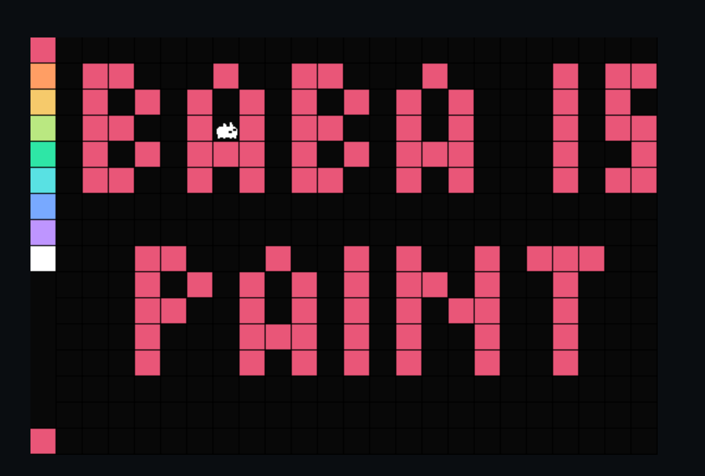
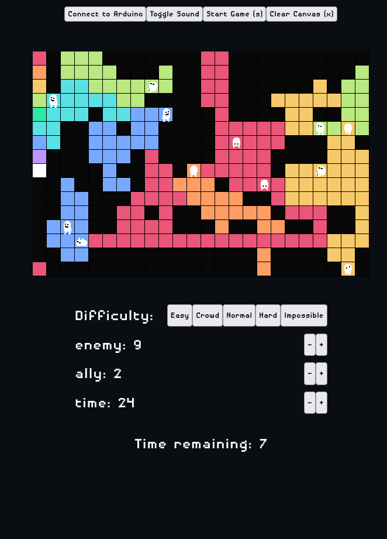
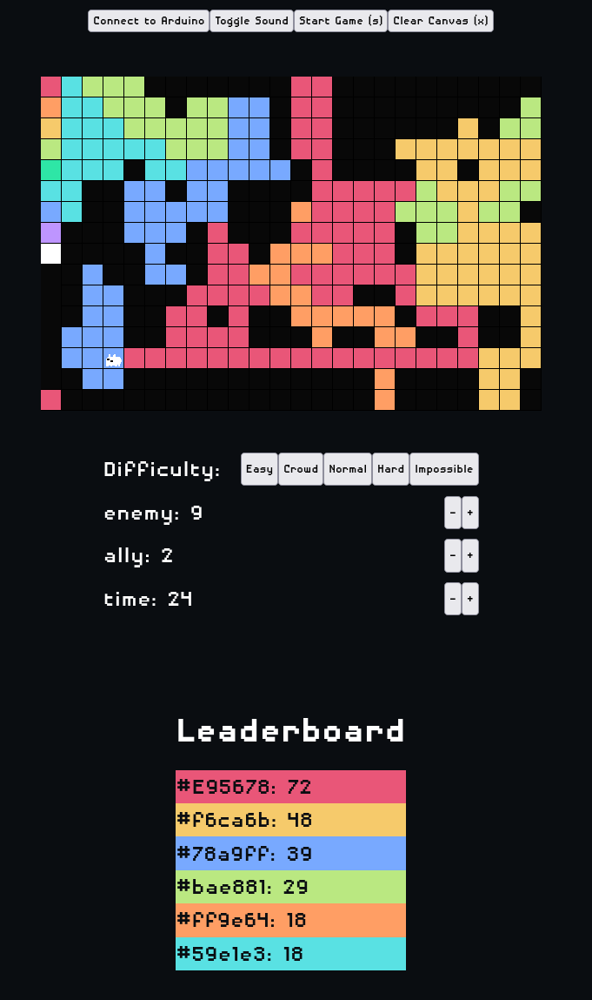

<h1 align="center">
    <br>
    Final Integration Project: Baba Is Paint Game
    <br>
</h1>


<p align="center">
  
</p>

## Description
A paint app with a game mode based on Splatoon paint game.

### Paint App
Paint the canvas by moving the character with arrow keys
or Arduino joystick (mouse can also paint but cannot move the character).
Eraser mode and ethereal mode can be toggle with <kbd>c</kbd> and <kbd>e</kbd>, respectively.

- Eraser mode: painting will erase the tile (change to canvas color) instead
- Ethereal mode: painting will not affect any tiles

### Ink Game
Game can be played by pressing the button <button>Start Game (s)</button> or the shortcut <kbd>s</kbd>.

There are several difficulty presets and game settings that you can modify to your liking.

|Game settings|Explaination|
|-------------|-----------|
Difficulty | 5 presets to change the enemy and ally amount
Enemy | amount of enemy (NPC that does NOT have your current selected color)
Ally | amount of ally (NPC that does have your current selected color)
Time (in seconds) | amount of time before the game end

When the game start, a certain amount of enemies and allies will spawn at some random unoccupied
location. A timer will start counting down. When the game end, a leaderboard will pop up
to show the amount of tiles each participating color occupied (in descending order).
Try to get first place in the leaderboard!

## Images
<p align="center">
  
</p>
<p align="center">
  
  
</p>

## Video
[Youtube Link](https://youtu.be/vL-UXtPLZm4)

<!-- ## Schematics, diagrams, or images to understand -->
<!-- TODO: -->
<!---->
<!-- NOTE: The Arduino joystick wiring was modified so that it is easier to hold. -->
<!---->
<!-- left/right -> up/down -->
<!-- up/down -> right/left -->
<!-- x and y is flipped and right and left is inverted -->
<!---->
<!-- To use the joystick normally, use the commented out code (line 97 and 100), -->
<!-- and switch the x and y wire. -->

## Control

| Key | Description |
|-----|-------------|
q/w | previous/next color
s | start ink game
e | ethereal toggle (no color impact) (still has collision)
c | eraser toggle (remove color)
x | clear canvas
a | spawn ally (cheat)
f | spawn enemy/foe (cheat)

## Arduino
I included Arduino code in case you want to try the joystick control

The Arduino code and wiring is pretty basic.
<!-- There are some minor modifications to make the joystick easier to use when not mounted. -->
<!-- The x and y value is switched. So the VRX_PIN A0 is actually controlling the y-axis -->

Here's the code snippet for Arduino wiring.
```c
#define VRX_PIN  A0 // Arduino pin connected to VRX pin
#define VRY_PIN  A1 // Arduino pin connected to VRY pin
// ...
const int NEXT_COLOR_PIN = 12;
// RGB LED PIN
const int PIN_RED = 5;
const int PIN_GREEN = 6;
const int PIN_BLUE = 3;
```

### Note
In the video, the schematic & code is modified so that the joystick is easier to hold when unmounted:
The wires of pin A0 & A1 are switched, and 2 lines of code were replaced.
```c
// ...
// check left/right commands
if (xValue < LEFT_THRESHOLD)
  command = "LEFT"; // correct (normal)
  // command = "RIGHT"; // my version
else if (xValue > RIGHT_THRESHOLD)
  command = "RIGHT"; // correct
  // command = "LEFT"; // my version
// ...
```

<!-- I wasn't able to find a diagram creator for the schematics, but it's pretty basic. -->

## Thoughts about Future Development
There are a lot of features that I want to implement,
and a lot more bugs that I want to fix. **But...**

The project's code is based on my previous project's code when I know less about Javascript
& good programming practices.

Because of that, the code is full of temporary and hacky solutions to the problems I encountered,
such as the `gridArray` having 1 empty row for collision checking and 1 empty column
for the color palette (this lead to one of the bug below)
and several unused features, such as the ability for character to push objects/other characters.

It's really annoying to add more features or fix bugs without some major reworks first
because the code is not good.

### Features & Fixes List:
- feat: indicator for eraser mode
- fix: ethereal mode sprite (current version default to the left facing sprite when switched to and from)
- feat: smarter AI for NPC (ally/enemy)
- feat: disable collision toggle
- feat: push NPC
- fix: character collision sometimes does not work when there are too many NPC
- fix: mouse can cheat because it can modify the color square outside the canvas
(because of the empty row mentioned above)


